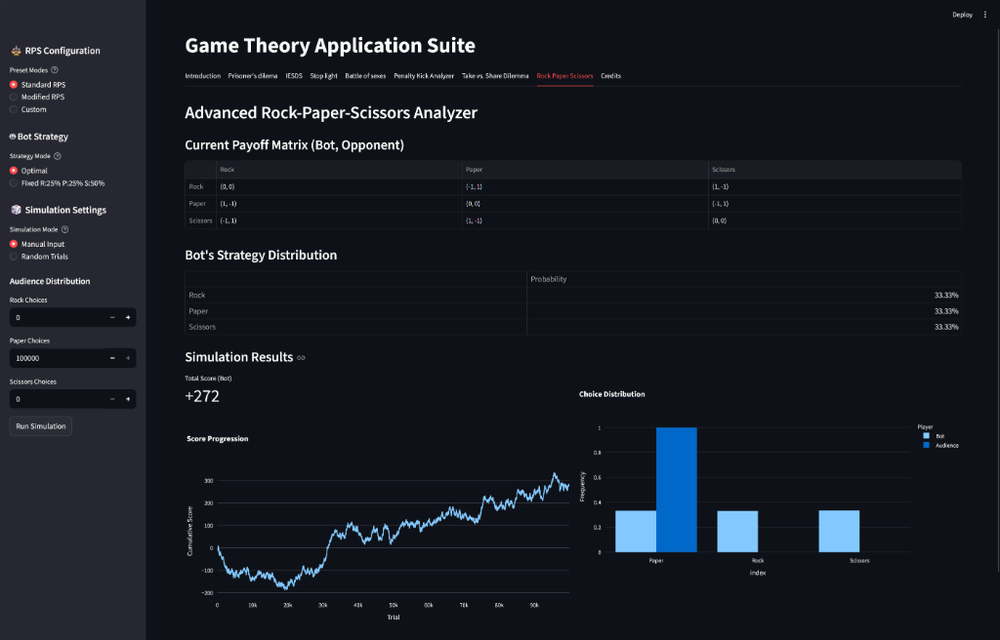
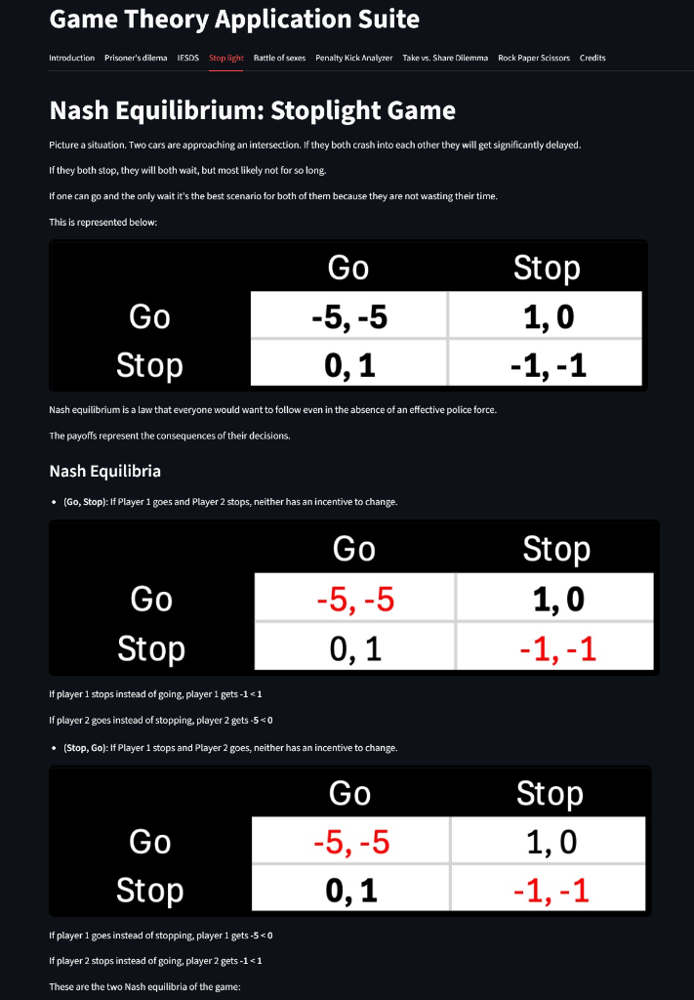

# Game Theory Application Suite

An interactive, modular Python application designed for modeling, analyzing, and visualizing fundamental concepts in Game Theory. Built with Streamlit, NumPy, Pandas, Matplotlib, and Plotly, this application provides dynamic simulations, strategy solvers, and mathematical breakdowns for classical strategic scenarios.

---

## Application Screenshots

### Rock-Paper-Scissors Analyzer & Monte Carlo Simulation


### Nash Equilibrium: Stoplight Coordination Game


---

## Technical Highlights

- **Modular Architecture**: Complete separation of concerns between core mathematical domain logic, data visualization utilities, and Streamlit user interface components.
- **Monte Carlo Simulation Engine**: High-performance simulation capability executing up to 100,000 randomized iterations for strategy evaluation in non-zero-sum and zero-sum games.
- **Automated Unit Testing**: Fully tested domain layer utilizing Pytest to ensure algorithmic correctness and numerical stability.
- **Dynamic Visualization Pipeline**: Real-time rendering of statistical distributions, payoff trade-offs, score progression lines, and custom geometric matplotlib goal diagrams.

---

## Modules & Game Models

### 1. Prisoner's Dilemma Simulator
Models the classic non-zero-sum game demonstrating the tension between individual rationality and mutual cooperation. Features interactive rounds against automated agents executing strategies including Tit-for-Tat, Always Confess, Always Keep Quiet, and Uniform Random selection.

### 2. Penalty Kick Strategy Analyzer
Implements zero-sum game models applied to sports strategy (kicker versus goalkeeper). Computes optimal mixed-strategy probabilities based on directional effectiveness. Features empirical strategy presets for professional players (Lionel Messi and Cristiano Ronaldo) and renders a color-coded spatial shot distribution diagram.

### 3. Advanced Rock-Paper-Scissors (RPS) Engine
Provides configurable payoff matrices (Standard, Modified, and Custom), an automated optimal strategy solver based on expected utility, and a Monte Carlo simulation engine supporting up to 100,000 trials with live score progression tracking.

### 4. Iterated Elimination of Strictly Dominated Strategies (IESDS)
Provides structured visual and mathematical explanations of strict dominance, enabling matrix simplification and rational strategy prediction.

### 5. Stoplight Coordination Game
Demonstrates pure-strategy Nash Equilibria in traffic intersection scenarios, illustrating coordination games where mutual deviation offers no benefit.

### 6. Battle of the Sexes (Mixed Strategy & Expected Utility)
Explores coordination problems by contrasting pure strategies with mixed strategies. Computes Expected Utility metrics and validates payoff trade-offs using mathematical formulations.

### 7. Take vs. Share Dilemma
Analyzes dominant strategy dynamics under uncertainty, visualizing expected payoffs relative to opponent decision probabilities.

---

## Project Structure

```text
Game-Theory-Assignment/
├── app.py                         # Main Streamlit application entrypoint
├── Demo.py                        # Backward-compatible wrapper script
├── pyproject.toml                 # Package definition and Pytest configuration
├── requirements.txt               # Project dependencies
├── src/
│   └── game_theory/
│       ├── core/                  # Pure mathematical models & algorithms
│       │   ├── penalty_kick.py
│       │   ├── prisoners_dilemma.py
│       │   ├── rps.py
│       │   └── take_share.py
│       ├── utils/                 # Data visualization helpers
│       │   ├── charts.py
│       │   └── goal_drawing.py
│       └── views/                 # Isolated Streamlit UI views
│           ├── tab_intro.py
│           ├── tab_prisoners.py
│           ├── tab_penalty.py
│           ├── tab_rps.py
│           └── ...
├── tests/                         # Automated Pytest suite
│   ├── test_penalty_kick.py
│   ├── test_prisoners_dilemma.py
│   └── test_rps.py
└── images/                        # Game theory diagrams, assets, and screenshots
    ├── rps_analyzer_screenshot.png
    ├── stoplight_game_screenshot.png
    └── ...
```

---

## Technology Stack

- **Language**: Python 3.8+
- **Frontend / Framework**: Streamlit
- **Data Processing & Analytics**: NumPy, Pandas
- **Visualization**: Plotly, Matplotlib
- **Testing**: Pytest

---

## Installation & Usage Instructions

### Prerequisites

Ensure Python 3.8 or higher is installed on your system.

### 1. Clone the Repository

```bash
git clone https://github.com/TarasZinchenko/Game-Theory-Assignment.git
cd Game-Theory-Assignment
```

### 2. Install Dependencies

```bash
pip install -r requirements.txt
```

### 3. Run the Application

Execute the application via Streamlit:

```bash
python -m streamlit run app.py
```

---

## Running Automated Tests

To execute the unit test suite and verify domain logic:

```bash
python -m pytest
```

---

## Contributors

- Taras Zinchenko
- Tim Huijbens
- Jan Jelínek
- Žygimantas Mickavičius
- Jaden Mannes
